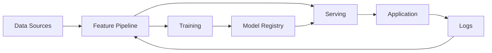

# Week 01 Thursday: ML System Design

**Week:** [Week 01](../week-01.md)  
**7-in-30:** [Thursday quant problems](../../quant-7-in-30/week-01/thursday.md)  
**Quant performance:** 0 / 7 in 30 minutes  
**Topic:** TBD

## Focus

ML system design and production architecture.

## Prompt

> TBD

## Clarify

- User or stakeholder:
- Decision being supported:
- Business objective:
- Constraints:

## Design

## Evaluation And Monitoring

TBD

## Takeaway

TBD
