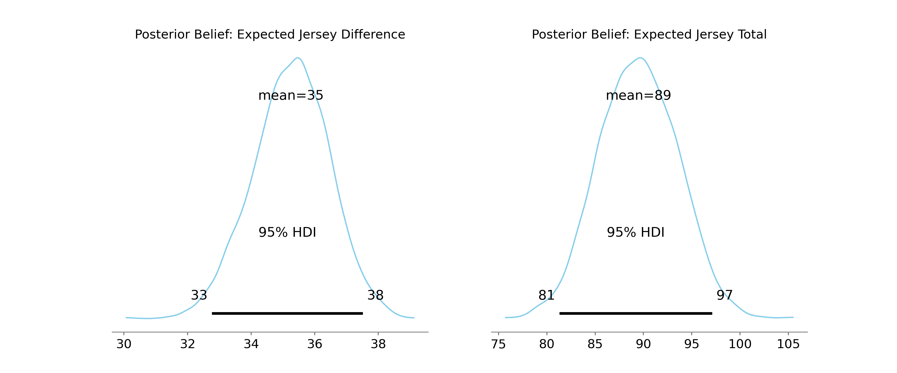

# A Fairly Odd Bet

We're currently in the 2026 NHL Stanley Cup Playoffs. 

My dad and I have been setting betting lines on weird prop bets for the Oilers vs Ducks series. 

As we head in to game five, it's my turn to set some lines. 

<!-- more -->

I chose what I believed to be a pretty weird pair of bets:

- [D] Will the absolute difference between the jersey number of the first Anaheim player to score and the first Edmonton player to score be Over or Under 27.5?

    - Example: If Troy Terry (19) scores first for Anaheim and Connor McDavid (97) scores first for Edmonton, the difference is 78 (97 minus 19), so the "Over" wins.

- [S] Will the combined sum of the jersey numbers of the first Anaheim player to score and the first Edmonton player to score be Over or Under 75.5?

    - Example: Using those same two players, Terry (19) plus McDavid (97) equals a total of 116, so the "Over" wins.

For these two wagers I offered my dad 27.5 for the first wager which I've labeled $D$, and the 75.5 for the second wager I've labeled $S$. 

He's taken both unders.

As we'll see these were pretty poor picks according to my model. Now the game happens tonight, so we'll see how it actually plays out. But I'm fairly confident I'll take both wagers. 

## A Frequentist Estimate
To start, I used the NHL's exposed Stats API to pull all regular season games over the 2025-2026 season. For each game I used the play-by-play to find which player scored first for each team. Using these counts, we can get team estimates of first goal rates. 

We'll now build simple first guess models for the matchup tonight. 
### Probabilities and Random Variables

Let $X$ be the discrete random variable representing the jersey number of Anaheim's first goal scorer. 
Let $Y$ be the discrete random variable representing the jersey number of Edmonton's first goal scorer.

Their sample spaces are the jersey numbers of the players on each roster:

$X \in \{x_1, x_2, \dots, x_n\}$

$Y \in \{y_1, y_2, \dots, y_n\}$

We define their probability mass functions using the empirical frequency of their past "team first goals:"

$P(X = x_i) = p_i$

$P(Y = y_j) = q_j$

Assuming which Anaheim player scores first for Anaheim is completely independent from which Edmonton player scores first, the joint probability of a specific pair of players scoring is just:

$$
P(X = x_i \cap Y = y_j) = p_i \cdot q_j
$$

### Defining wagers
We have two new random variables based on $X$ and $Y$: 

- The Sum: $S = X + Y$ 
- The Diff: $D = |X - Y|$

### Expected Values

Because $S$ is just the combination of two indendent random variables, we can take advantage of the linearity of expectation to get:

$$
E[S] = E[X + Y] = E[X] + E[Y] \\
$$

$$
E[S] = \sum_{i=1}^n (x_i \cdot p_i) + \sum_{j=1}^m (y_j \cdot q_j)
$$

The second wager involves a non-linear transform so we instead we need to enumerate the full joint probability distribution:

$$
E[D] = E[|X - Y|] = \sum_{i=1}^n \sum_{j=1}^m |x_i - y_j| \cdot (p_i \cdot q_j)
$$

Running this through our data I get the initial estimates:

$$
S = 92.76 \\
$$

$$
D = 36.35
$$

### Some Real Lines

However, lines are normally set in increments of 0.5 and these estimates are just the mean so it's not guaranteed that these values reflect a 50/50 split of the probability mass. 
Instead we want to use the median and find a threshold which splits our cumulative distributions in half for each wager.

Let $Z$ represent either our sum ($S$) or our difference ($D$). We first compute our CDF, denoted as $F(z)$, which gives us the probability that an outcome will be less than or equal to a specific value $z$:

$$
F(z) = P(Z \leq z) = \sum_{k \leq z}P(Z=k)
$$
 

We then find the maximum integer $z^*$ where the cumulative probability does not exceed $50\%$:

$$
z^* = max\{z \in \mathbb{Z} | F(z) \leq 0.5 \}
$$

Then give our line for a wager as:

$$
L = z^* + 0.5
$$

We add this half to avoid a push. 

This is readily solvable using some python code and gives us the new lines: 

$$
S = 89.5 \\
$$

$$
D = 32.5
$$

In both cases, the medians were lower than the means suggesting the distribution of outcomes are right-skewed for both wagers.

## A Bayesian Look
Of course, these values are calculated using the regular season outcomes only. However, we have observed four additional games, meaning we have four additional data points for each team we can use. 

Let's take a Bayesian approach to this same problem. 

### Setting Priors
Let the two teams be Anaheim ($A$) and Edmonton ($E$).

- Let $K$ be the number of active players on team $A$, and $M$ be the number of active players on team $E$.

- let $j_A \in \mathbb{N}^K$ and $j_E \in \mathbb{N}^M$ be the vector of active player jersey numbers.

- let $\theta_A = \langle \theta_{A, 1}, \dots, \theta_{A, K} \rangle$, be the true unobserved probabilities of each player scoring the first goal for team $A$. Note that $\sum_{k=1}^K \theta_{A, k} = 1$.

- let $\theta_E = \langle \theta_{E, 1}, \dots, \theta_{E, M} \rangle$, be the corresponding vector for team $E$

We'll use the regular-season first goal counts as prior evidence. Let $c_A = \langle c_{A, 1}, \dots, c_{A, K} \rangle$ be the regular season counts for Anaheim, and $C_E$ be the regular season counts vector for Edmonton.

We have a handful of players between the two teams with no first goal counts, the majority of players also have 1 or fewer first goal counts. We'll apply Laplace smoothing to these counts by adding a single ghost first goal to each player. 

We define our prior hyperparameter for the Dirichlet distribution as, $\alpha_A = c_A + 1$ and $\alpha_E = c_E + 1$.

We then assign the Dirichlet distributions as the priors for our probability distributions:

$$
\theta_A = \text{Dirichlet}(\alpha_A)\\
$$

$$
\theta_E = \text{Dirichlet}(\alpha_E)
$$

### Updating our Beliefs

We have observed data consisting of $N_A$ playoff goals for Anaheim and $N_E$ goals for Edmonton. 
Let $y_A = \langle y_{A, 1}, \dots, y_{A, K} \rangle$ be the observed coounts of playoff first goals for each player. 

Given the probability vectors, we'll assume goal counts follow a Multinomial distribution:

$$
y_A | \theta_A \sim \text{Multinomial}(N_A, \theta_A)\\
$$

$$
y_E | \theta_E \sim \text{Multinomial}(N_E, \theta_E)
$$

The Dirichlet distribution is the conjugate prior for the Multinomial likelihood, so the posterior is analytically exact. We just add the observed playoff counts to our prior hyperparameters:

$$
\theta_A | y_A \sim \text{Dirichlet}(\alpha_A + y_A)\\
$$

$$
\theta_E | y_E \sim \text{Dirichlet}(\alpha_E + y_E)
$$

We'll use pymc to perform the sampling. For every step $s$ in the MCMC chain we draw a sample $\theta_A^{(s)}$ and $\theta_E^{(s)}$ from the posterior. Using this sample we compute the exact expected values for the current sample state. 

### Expected Values
By linearity of expectations we just need the dot product of the probability vectors and the jersey vectors:

$$
E[S]^{(s)} = (\theta_A^{(s)} \cdot j_A) + (\theta_E^{(s)} \cdot j_E)
$$

We multiply the outer product of $\theta_A^{(s)} \otimes \theta_E^{(s)}$ with the pairwise absolute difference of the jersey numbers:

$$
E[D]^{(s)} = \sum_{k=1}^K \sum_{m=1}^M (\theta_{A, k}^{(s)} \theta_{E, m}^{(s)} |j_{A, k} - j_{E, m} )
$$

### Lines I Believe In
Sampling from our posterior trace gives us our marginal posterior distributions for $p(E[S] \vert y_A, y_E)$ and $p(E[D] \vert y_A, y_E)$. 

Which gives us the new lines:

$$
S = 89.5 \\
$$

$$
D = 35.5
$$

## Closing comments
The final estimates from our Bayesian model were fairly close to the frequentist, the key difference that $D$ was closer to the raw mean estimate of the frequentist. 

As I mentioned, my dad's taken both Under wagers. If you check the posterior plots you can see my original lines are way below the posteriors and estimates from either the Bayesian or Frequentist. 

Actually, under the posterior, my original Under lines occur around $0-0.2\%$ of the time... which is great news for the Over.

So the Under is actually a terrible wager. 

